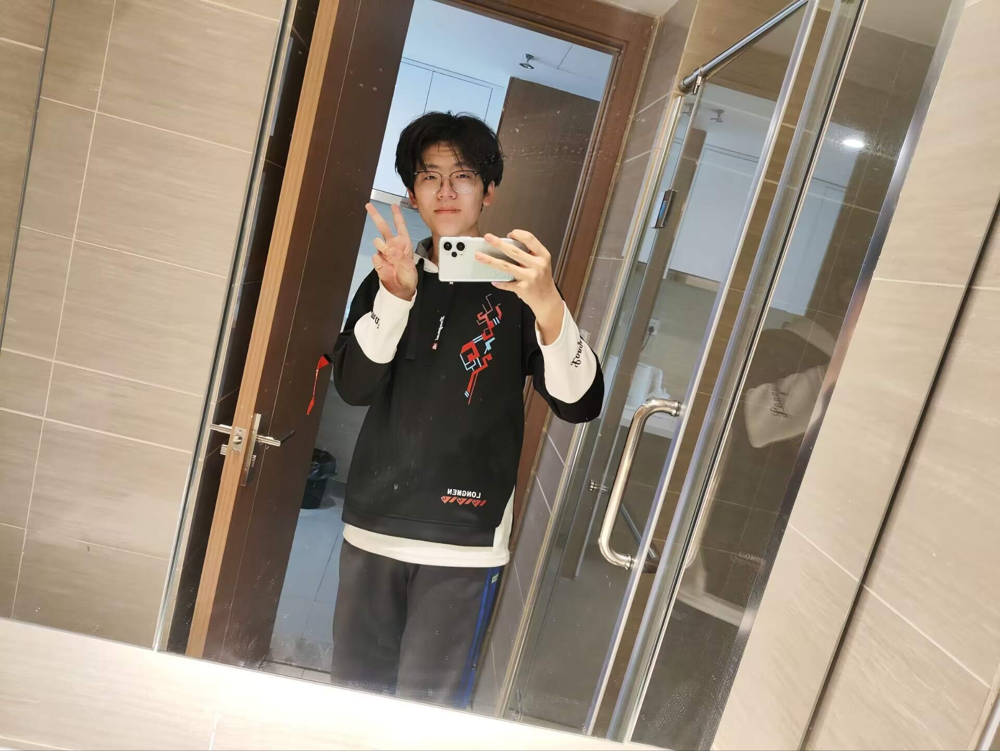

# 个人简介

我是一个热爱编程，对新技术充满好奇的年轻人。我拥有扎实的计算机科学基础，熟悉多种编程语言，包括但不限于 Python、Java、C++等。同时，我也对人工智能、大数据等领域有着浓厚的兴趣，并积极学习相关技术。
在大学期间，我积极参与各类编程比赛和实践项目，积累了丰富的项目经验。我具备良好的团队协作能力和沟通能力，能够迅速融入团队，与团队成员共同完成任务。此外，我还具备较强的自学能力和解决问题的能力，能够独立解决遇到的技术难题。

在未来的工作中，我希望能够充分发挥自己的专业技能和热情，为团队和公司创造价值。我期待能够加入一个充满活力和创新氛围的公司，与优秀的同事一起成长，共同进步。

