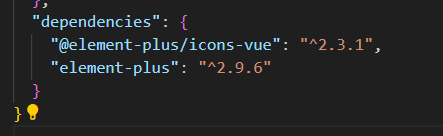
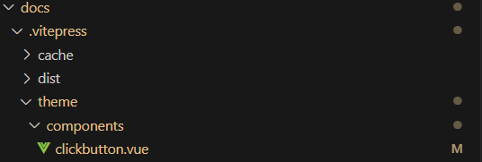
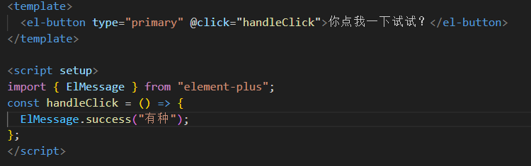
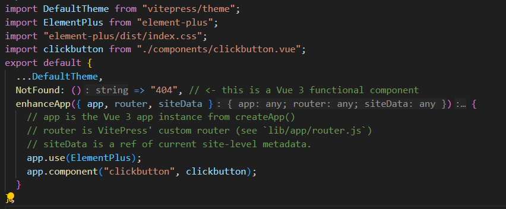

# vitepress+Elementplus

接下来的是我个人认为最傻逼的一个部分：

如何将 elemenplus 集成到一个 vitepress 项目中去

想当初，在 vitepress 官网中看到所谓的**_完美_**适配 elementplus，于是我兴致勃勃的开始了操作，现在想想真想骂 vitepress 项目组两句，他妈的说是简单，倒是给一点教程啊尼玛的

## 1.安装一个 vitepress 项目

首先在想要安装的文件夹中打开终端，输入以下命令：

```bash
npx vitepress init
```

接回答一些问题：

```
┌ Welcome to VitePress!
│
◇ Where should VitePress initialize the config?
│ ./docs
│
◇ Where should VitePress look for your markdown files?
│ ./docs
│
◇ Site title:
│ My Awesome Project
│
◇ Site description:
│ A VitePress Site
│
◇ Theme://注意此处如果选择默认主题的话，.vitepress文件夹下是不会有theme文件夹的，后续需要手动创建，如果选择custom则不用
│ Default Theme
│
◇ Use TypeScript for config and theme files?
│ Yes
│
◇ Add VitePress npm scripts to package.json?
│ Yes
│
◇ Add a prefix for VitePress npm scripts?
│ Yes
│
◇ Prefix for VitePress npm scripts:
│ docs
│
└ Done! Now run pnpm run docs:dev and start writing.
```

## 2.安装 elementplus

在终端中输入以下命令：

```bash
pnpm add element-plus
```

此时可以先查看一下自己项目的 package.json 文件，看看以来中有没有出现 elemenplus



## 3.配置 index.ts 文件

:::tip
index.ts 文件的位置在.vitepress/theme 文件夹下，如果没有这个文件，就自行创建一个
:::

index.ts 文件内容如下：

```ts
import DefaultTheme from "vitepress/theme";
import ElementPlus from "element-plus";
import "element-plus/dist/index.css";
export default {
  ...DefaultTheme,
  NotFound: () => "404", // <- this is a Vue 3 functional component
  enhanceApp({ app, router, siteData }) {
    // app is the Vue 3 app instance from createApp()
    // router is VitePress' custom router (see `lib/app/router.js`)
    // siteData is a ref of current site-level metadata.
    app.use(ElementPlus);
  }
};
```

仔细观察，发现其结构和 vue3 的 main.ts 文件非常相似，所以我们可以大胆的猜测，vitepress 的 theme 文件就是 vue3 的 main.ts 文件，天才般的发现！:)

<br>
<br>
<br>
<br>
<br>

---

# 开始使用

经过上面的准备操作，现在就可以正式开始使用 elementplus 的组件库了

## 自定义组件

首先在`theme`文件夹下创建一个`components`文件夹，然后在其中创建一个`自定义文件名.vue`的文件，文件内容是你想使用的各种 elementplus 组件：



<br>

然后在 `index.ts` 文件中引入这个组件，并注册：


## 使用实例

<clickbutton/>

:::warning
markwown 中不能直接使用 vue3 中的 script，所以需要写单独的自定义组件
:::
