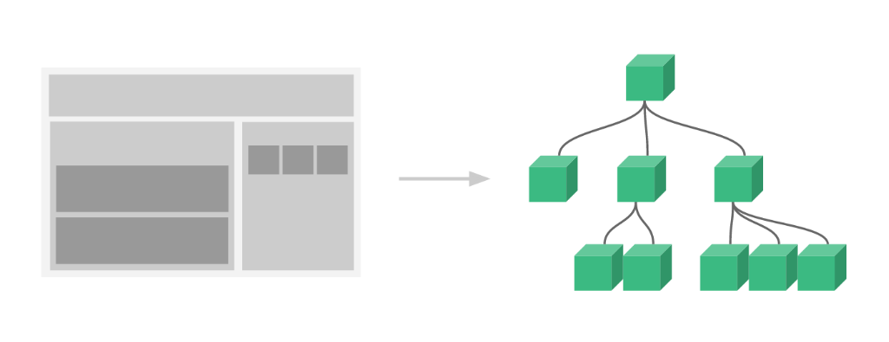
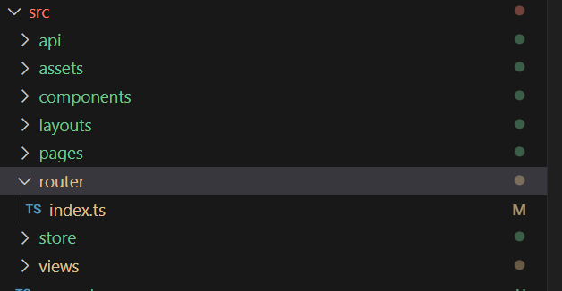

# vue3 基础

## vue3 简介

Vue.js 是一套构建用户界面的渐进式框架。

Vue 只关注视图层， 采用自底向上增量开发的设计。

Vue 的目标是通过尽可能简单的 API 实现响应的数据绑定和组合的视图组件。

渐进式框架的优点：

1.易于上手

2.灵活性高

3.提升开发效率

4.与其他技术的兼容性好

---

## vue3 项目创建

在命令行窗口中输入

```cmd
npm create vue@latest
```

之后的选项是要你选择使用的功能，例如路由，状态管理，css 样式表等
:::warning
在想要创建项目的目录下执行命令
:::

## vue3 项目结构

```js
├── node_modules
├── public
│   ├── favicon.ico
│   └── index.html
├── src
│   ├── assets
│   ├── components
│   ├── App.vue
│   ├── main.js
│   └── router
├── .gitignore
├── package.json
├── README.md
└── vue.config.js
```

:::tip
这只是大致描述一下结构，具体内容根据上一步所选择的功能不同会有一定的差距
:::

其中 `public` 文件夹用来存放公共资源，例如图片，logo 等

`src` 文件夹用来存放源代码，其中 `assets` 文件夹用来存放静态资源，`components` 文件夹用来存放组件，`App.vue` 是根组件（所有组件的爹），`main.js` 是入口文件，`router` 文件夹用来存放路由配置

`node_modules` 文件夹用来存放项目依赖

`package.json` 文件用来存放项目信息和依赖

`README.md` 文件用来存放项目说明

`vue.config.js` 文件用来存放项目配置

## vue3 项目运行

在命令行窗口中输入

```cmd
npm run serve
```

即可运行项目

## vue3 项目打包

在命令行窗口中输入

```cmd
npm run build
```

即可打包项目

这里有人就会问了：“主播主播，项目打包可以做什么呢？”

1.部署：将打包后的项目部署到服务器上，供用户访问

2.发布：将打包后的项目发布到应用商店，供用户下载安装

3.分享：将打包后的项目分享给他人，供他人使用

4.备份：将打包后的项目备份，以防项目丢失或损坏

5.测试：将打包后的项目进行测试，确保项目运行正常

反正就是还有很多用处了

---

<br>
<br>
<br>
<br>
<br>
<br>
<br>

# vue3 语法

## vue3 基础语法

```vue
<template>
  <div>
    <h1>{{ message }}</h1>
    <button @click="changeMessage">Change Message</button>
  </div>
</template>

<script>
export default {
  data() {
    return {
      message: "Hello Vue 3!"
    };
  },
  methods: {
    changeMessage() {
      this.message = "Hello World!";
    }
  }
};
</script>

<style scoped>
h1 {
  color: red;
}
</style>
```

代码整体由三部分组成：`template`、`script`、`style`，分别代表：模板、脚本、样式

`template` 中使用双花括号 `{{ }}` 来绑定数据，使用 `@click` 来绑定点击事件

`script` 中使用 `data` 来定义数据，使用 `methods` 来定义方法

`style` 中使用 `scoped` 来限定样式的作用范围

## vue3 条件渲染

`v-if` 和 `v-else` 是 Vue 中的条件渲染指令，用来根据条件来显示或隐藏元素

```vue
<template>
  <div>
    <h1 v-if="showMessage">Hello Vue 3!</h1>
    <h1 v-else>Goodbye Vue 3!</h1>
  </div>
</template>

<script>
export default {};
</script>
```

## vue3 列表渲染

`v-for` 是 Vue 中的列表渲染指令，用来根据数组或对象来渲染列表,其实就是 for 循环

```vue
<template>
  <div>
    <ul>
      <li v-for="item in items" :key="item.id">{{ item.name }}</li>
    </ul>
  </div>
</template>

<script>
export default {
  data() {
    return {
      items: [
        { id: 1, name: "Item 1" },
        { id: 2, name: "Item 2" }
      ]
    };
  }
};
</script>
```

## vue3 事件处理

`@click` 是 Vue 中的事件处理指令，用来绑定点击事件

```vue
<template>
  <div>
    <button @click="handleClick">Click me</button>
  </div>
</template>

<script>
export default {
  methods: {
    handleClick() {
      alert("Hello Vue 3!");
    }
  }
};
</script>
```

## vue3 双向绑定

`v-model` 是 Vue 中的双向绑定指令，用来绑定表单元素的值和组件的数据

```vue
<template>
  <div>
    <input v-model="message" />
    <p>{{ message }}</p>
  </div>
</template>

<script>
export default {
  data() {
    return {
      message: ""
    };
  }
};
</script>
```

## vue3 计算属性

`computed` 是 Vue 中的计算属性，用来定义计算属性，计算属性会根据依赖的数据自动更新

```vue
<template>
  <div>
    <p>{{ fullName }}</p>
  </div>
</template>

<script>
export default {
  data() {
    return {
      firstName: "John",
      lastName: "Doe"
    };
  },
  computed: {
    fullName() {
      return this.firstName + " " + this.lastName;
    }
  }
};
</script>
```

## vue3 监听器

`watch` 是 Vue 中的监听器，用来监听数据的变化，当数据发生变化时，会自动执行监听器中的方法(执行相应的回调函数)

`watch`允许我们观察和响应 vue 实例中特定的数据变化，从而执行一些副作用操作，比如更新 DOM，发网络请求等

```vue
<template>
  <div>
    <input v-model="message" />
    <p>{{ message }}</p>
  </div>
</template>

<script>
export default {
  data() {
    return {
      message: ""
    };
  },
  watch: {
    message(newValue, oldValue) {
      console.log("message changed from " + oldValue + " to " + newValue);
    }
  }
};
</script>
```

## vue3 组件

组件系统让我们可以用独立可复用的小组件来构建大型应用，几乎任意类的应用的界面都可以抽象为一个组件树



`components` 是 Vue 中的组件，用来定义组件，组件可以复用

```vue
<template>
  <div>
    <my-component></my-component>
  </div>
</template>

<script>
import MyComponent from "./MyComponent.vue"; //此处的MyComponent是自定义的组件，需要先在components中注册

export default {
  components: {
    MyComponent
  }
};
</script>
```

### Props

Props 是子组件用来接受父组件传递过来的数据的一个自定义属性

```vue
<template>
  <!--父组件-->
  <div>
    <my-component :message="message"></my-component>
  </div>
</template>

<script>
import MyComponent from "./MyComponent.vue";

export default {
  components: {
    MyComponent
  },
  data() {
    return {
      message: "Hello Vue 3!"
    };
  }
};
</script>
```

```vue
<template>
  <!--子组件-->
  <div>
    <p>{{ message }}</p>
  </div>
</template>

<script>
export default {
  props: {
    message: {
      type: String,
      required: true
    }
  }
};
</script>
```

### Emit

Emit 是父组件用来从子组件接受事件的一个自定义事件

```vue
<template>
  <!--父组件-->
  <div>
    <my-component @change="handleChange"></my-component>
  </div>
</template>

<script>
import MyComponent from "./MyComponent.vue";

export default {
  components: {
    MyComponent
  },
  methods: {
    handleChange() {
      console.log("message changed");
    }
  }
};
</script>
```

```vue
<template>
  <!--子组件-->
  <div>
    <button @click="handleChange">Change message</button>
  </div>
</template>

<script>
export default {
  methods: {
    handleChange() {
      this.$emit("change");
    }
  }
};
</script>
```

### Slot

Slot 是父组件用来向子组件传递模板内容的一个自定义插槽

```vue
<template>
  <!--父组件-->
  <div>
    <my-component>
      <p>This is a slot content</p>
    </my-component>
  </div>
</template>

<script>
import MyComponent from "./MyComponent.vue";

export default {
  components: {
    MyComponent
  }
};
</script>
```

```vue
<template>
  <!--子组件-->
  <div>
    <slot></slot>
  </div>
</template>

<script>
export default {};
</script>
```

<br>
<br>
<br>
<br>
<br>
<br>

---

# vue3 路由

路由（Router）在创建 vue 项目时可以选择使用安装，也可以在后期手动安装

一般会在项目中创建专门的`router`文件夹来存放路由相关的文件，主要是`index.js`文件，也就是路由设置



## vue3 路由设置

```js
import { createRouter, createWebHistory } from "vue-router";
import Home from "../views/Home.vue";
import About from "../views/About.vue";

const routes = [
  {
    path: "/",
    name: "Home",
    component: Home
  },
  {
    path: "/about",
    name: "About",
    component: About
  }
];

const router = createRouter({
  history: createWebHistory(process.env.BASE_URL),
  routes
});

export default router;
```

有了以上的路由设置后，就可以手动在你的网址后面加上/about 或/home 来访问 About 或 Home 组件了

## vue3 路由使用

在`main.js`中引入路由

```js
import { createApp } from "vue";
import App from "./App.vue";
import router from "./router";

createApp(App).use(router).mount("#app");
```

在`App.vue`中使用路由

```vue
<template>
  <div id="app">
    <router-link to="/">Home</router-link>
    <router-link to="/about">About</router-link>
    <router-view></router-view>
  </div>
</template>

<script>
export default {};
</script>
```

其中，`<router-link>` 是用来创建路由链接的，`<router-view>` 是用来显示路由组件的

### router.push

:::warning
以下两种 router 的使用方式都是需要使用组合式 API 的，即在使用前先定义`const router=useRouter()`来获取路由实例，具体请看组合式 API 部分
:::

`router.push` 是用来跳转到指定路由的，可以传入一个字符串或者一个对象

```js
router.push("/about");
router.push({ name: "About" });
```

### router.replace

`router.replace` 是用来替换当前路由的，可以传入一个字符串或者一个对象，导航后 不会留下 history 记录

```js
router.replace("/about");
router.replace({ name: "About" });
```

# 组合式 API

组合式 API 是 vue3 的新特性，它允许我们在一个组件中定义多个逻辑，并且可以方便地复用这些逻辑

## setup

`setup` 是组合式 API 的入口函数，它会在组件创建之前被调用，并且只被调用一次

```js
export default {
  setup() {
    // 在这里定义组件的逻辑
  }
};
```

也可以写成：

```ts
<script lang="ts" setup></script>
```

在 vue 中使用组合式 API 的`<script setup>`语法糖时，不需要再显式的使用 `return` 语句来暴露组件的响应式状态和方法，因为它们会自动暴露给模板使用，甚至不再需要 `export default` 了,
例如：

```ts
<script lang="ts" setup>
import { ref } from 'vue';

const count = ref(0);

const increment = () => {
  count.value++;
};
</script>

<template>
  <div>
    <p>{{ count }}</p>
    <button @click="increment">Increment</button>
  </div>
</template>
```

:::tip
有关 ts 的知识以后再说
:::

## ref

`ref` 是用来创建响应式数据的，它可以接受一个初始值，并且返回一个包含该初始值的响应式对象

```js
import { ref } from "vue";

export default {
  setup() {
    const count = ref(0);
    return {
      count
    };
  }
};
```

## reactive

`reactive` 是用来创建响应式对象的，它可以接受一个对象，并且返回一个包含该对象的响应式对象

```js
import { reactive } from "vue";

export default {
  setup() {
    const state = reactive({
      count: 0
    });
    return {
      state
    };
  }
};
```

<br>
<br>
<br>
<br>
<br>

---

# vue3 axios

## axios 简介

Axios 是一个基于 Promise 的 HTTP 客户端，用于浏览器和 node.js。它支持多种请求方法，如 GET、POST、PUT、DELETE 等，并且可以设置请求头、请求参数、请求拦截器、响应拦截器等。

## axios 安装

使用 npm 或 yarn 安装 axios：

```bash
npm install axios
# or
yarn add axios
```

## axios 引入

在 Vue3 中使用 axios，首先需要导入 axios：

```js
import axios from "axios";
```

## axios 配置封装

一般在项目开发中会专门创建`request.ts`或`http.ts`文件来配置 axios
例如：

```js
//选自用户管理中心项目
import axios from "axios";

const myAxios = axios.create({
  baseURL: "http://localhost:8080", //请求的根路径,一般是后端的接口地址
  timeout: 5000,
  withCredentials: true
});

//请求拦截器
myAxios.interceptors.request.use(
  config => {
    //在发送请求之前做些什么
    return config;
  },
  err => {
    //对请求错误做些什么
    return Promise.reject(err);
  }
);

//响应拦截器
myAxios.interceptors.response.use(
  response => {
    //console.log(response);
    const { data } = response;
    //console.log(data);

    if (data.code === 40100) {
      //不是获取用户信息接口，或者不是登录页面，则跳转到登陆页面
      if (
        !response.request.responseURL.includes("/user/current") &&
        !window.location.pathname.includes("user/login")
      ) {
        window.location.href = `user/login?redirect=${window.location.href}`;
      }
    }
    return response;
  },
  err => {
    //对响应错误做些什么
    return Promise.reject(err);
  }
);

export default myAxios;
```

:::info
axios 不用再 main.ts 中引入，而是再有需要的页面中单独引用
:::

## axios 请求

axios 支持多种请求方法，如 GET、POST、PUT、DELETE 等，下面是使用 axios 发送 GET 请求的示例：

```js
axios
  .get("/api/data")
  .then(response => {
    console.log(response.data);
  })
  .catch(error => {
    //...错误处理
  });
```

发送 POST 请求的示例：

```js
axios
  .post("/api/data", { name: "John", age: 30 })
  .then(response => {
    console.log(response.data);
  })
  .catch(error => {
    //...错误处理
  });
```

## 异步

异步是为了避免阻塞主线程，提高用户体验

axios 支持异步请求，可以使用 async/await 语法来处理异步请求，例如：

```js
async function fetchData() {
  try {
    const response = await axios.get("/api/data");
    console.log(response.data);
  } catch (error) {
    //...错误处理
  }
}
```

:::tip
axios 的请求方法都支持 async/await 语法
异步操作通常在一下情况中使用

1.数据获取：在组件创建或更新时，需要从服务器获取数据

2.异步计算属性，当计算属性依赖于异步数据时，可以使用异步操作。在这种情况下，计算属性需要返回一个 Promise 对象

3.异步方法：在方法中执行异步操作，例如在用户点击按钮时发送网络请求

4.异步生命周期钩子：vue3 允许在生命周期钩子中使用异步操作
:::
